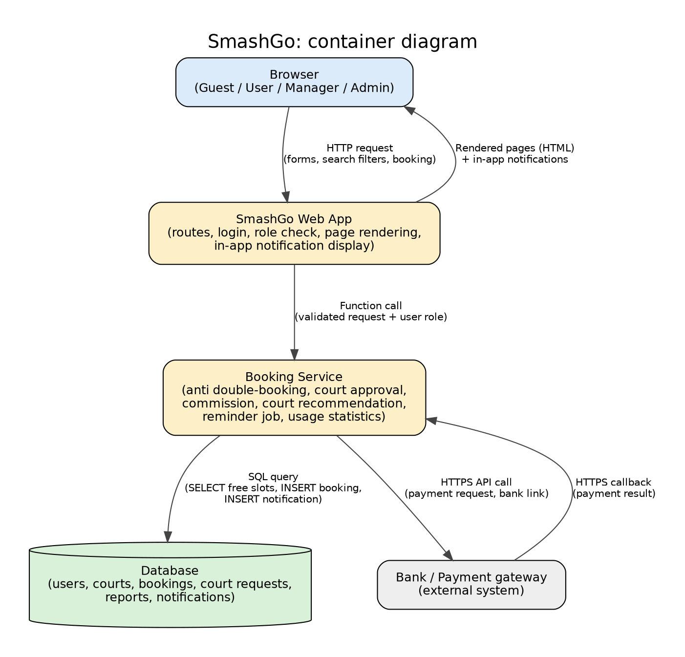
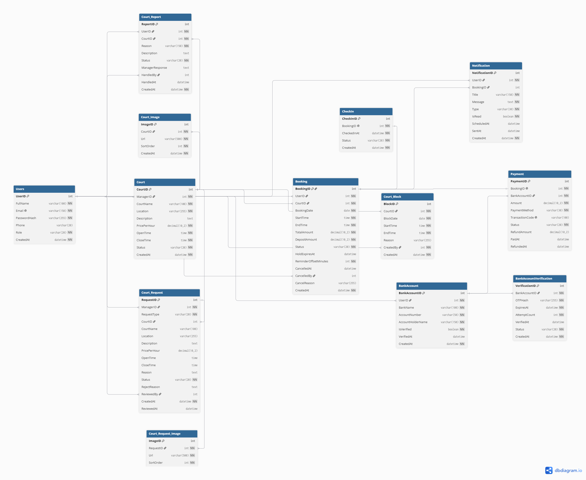

# Milestone 2 - Design Document

**Team:** Team 01 - SmashGo

**Topic:** D2 - Sports Platform

**Members:**

- Chử Vũ Thảo Hiền (ID: 11247287)
- Phan Thị Anh Quỳnh (ID: 11247347)
- Bùi Phương Thảo (ID: 11247353)

**Product Owner:** @dqchien

**Scrum Master:** @Buithaoaineu (Sprint 2)

**Repository:** https://github.com/SE-FDA-NEU-AI66B/software-group1-topicd2

**Project board:** https://github.com/orgs/SE-FDA-NEU-AI66B/projects/24

**Setup guide:** https://github.com/SE-FDA-NEU-AI66B/software-group1-topicd2/blob/main/docs/SETUP.md

**Submitted by:** Chử Vũ Thảo Hiền

---

**Project board right after Sprint 2 Planning:**


**Project board on the submission day:**


---

## 1. Architecture

SmashGo is a badminton court booking platform with four roles: **Guest** (not logged in; browses courts), **User** (books, pays, reports a court), **Manager** (court owner: adds, edits and deletes **their own** courts; a new court must be approved by an Admin before it is public) and **Admin** (approves new courts, enables or disables courts, follows the dashboard and the commission earned from Managers). All four roles use the system through a web browser. The diagram below shows the container level (C4): what runs where, and what travels along every arrow.



### 1.1 Components

| Component              | Runs where                            | Responsibility                                                                                                                                                                                                                                                                                                                                                                                                                                                                         |
| ---------------------- | ------------------------------------- | -------------------------------------------------------------------------------------------------------------------------------------------------------------------------------------------------------------------------------------------------------------------------------------------------------------------------------------------------------------------------------------------------------------------------------------------------------------------------------------- |
| Browser                | User's phone or computer              | Shows pages to Guest, User, Manager and Admin (including the login screen); sends forms, search filters and booking requests.                                                                                                                                                                                                                                                                                                                                                          |
| SmashGo Web App        | Application server (Python, `app.py`) | Handles routes, login, role checks (Guest / User / Manager / Admin) and renders HTML pages, including the in-app notifications. Also exposes the JSON API (`/api/...`, section 3). Passes validated requests to the Booking Service.                                                                                                                                                                                                                                                   |
| Booking Service        | Same server, separate module          | Enforces the business rules: no double booking of one court in one time slot, 10-minute payment hold, new-court requests waiting for Admin approval, commission (a configured percentage of successful payments), court search/recommendation by filter, usage statistics by time slot for the Admin dashboard. Also runs a **background job** (every minute) that (a) expires `PENDING` bookings whose hold has ended and (b) releases due booking reminders as in-app notifications. |
| Database               | SQLite file (`data/`, not committed)  | Stores users, courts, bookings, payments, bank accounts, court requests, court reports and notifications. Its constraints back up the rules above.                                                                                                                                                                                                                                                                                                                                     |
| Bank / Payment gateway | External system                       | Verifies the linked bank account (OTP) and confirms payment for a booking.                                                                                                                                                                                                                                                                                                                                                                                                             |

### 1.2 Connections

| From → To                                | What travels along it                                                                                                                                              |
| ---------------------------------------- | ------------------------------------------------------------------------------------------------------------------------------------------------------------------ |
| Browser → Web App                        | HTTP request (login form, search filters, booking form, court management form, Admin review form)                                                                  |
| Web App → Browser                        | Rendered pages (HTML), including in-app notifications; JSON responses for `/api/...`                                                                               |
| Web App → Booking Service                | Function call (validated request together with the user's id and role)                                                                                             |
| Booking Service → Database               | SQL query (SELECT free time slots, INSERT booking, INSERT court request, UPDATE approval status, INSERT/UPDATE notification, aggregate payments for the dashboard) |
| Booking Service → Bank / Payment gateway | HTTPS API call (bank-link/OTP request, payment request); the result comes back in the HTTPS response of the same call (no separate callback)                       |

### 1.3 How the main flows move through the system

- **User books a court:** Browser sends the booking form (HTTP request) → Web App checks that the user is logged in → Booking Service checks the time slot is free and inserts a `PENDING` booking with a 10-minute hold (SQL query, inside a `BEGIN IMMEDIATE` transaction) → User pays with a verified bank account → Booking Service sends the payment request to the Bank (HTTPS API call) and reads the result from the response → on success the booking becomes `CONFIRMED`, a `Payment` row is saved and a reminder notification is scheduled (SQL query) → page confirms the booking.
- **Manager adds a new court:** Manager submits the court form → Booking Service stores it as a `Court_Request` with status `PENDING` (SQL query) → Admin sees the pending request and approves or rejects it → only after approval a `Court` row is created and shown to Guests and Users. The Manager can edit or delete (soft-disable) their own courts directly; no Admin approval is needed for that.
- **Admin dashboard:** Admin opens the dashboard → Booking Service aggregates courts, bookings, successful payments (commission = `COMMISSION_RATE` from `.env` × net paid amount) and bookings by time slot (SQL query) → Web App renders the numbers.
- **Reminder:** when a booking is paid, the Booking Service inserts a `Notification` with `ScheduledAt` = start time − `ReminderOffsetMinutes` (default 4 hours). The background job marks due notifications as sent (`SentAt`), skipping cancelled bookings. The next time the User's browser loads a page (HTTP request), the Web App reads the unread sent notifications and shows them. No external notification service is used.

---

## 2. Data model

### 2.1 ERD



### 2.2 Table descriptions

#### `Users`: Stores all user accounts and their roles in the SmashGo system.

| Column       | Type         | PK  | FK  | Constraint                                                 | Enforces (M1 rule)  |
| ------------ | ------------ | --- | --- | ---------------------------------------------------------- | ------------------- |
| UserID       | INTEGER      | ✔   |     | `PRIMARY KEY`, `AUTO_INCREMENT`                            |                     |
| FullName     | VARCHAR(100) |     |     | `NOT NULL`                                                 |                     |
| Email        | VARCHAR(150) |     |     | `NOT NULL`, `UNIQUE`                                       | Login               |
| PasswordHash | VARCHAR(255) |     |     | `NOT NULL`                                                 |                     |
| Phone        | VARCHAR(20)  |     |     |                                                            |                     |
| Role         | VARCHAR(20)  |     |     | `NOT NULL`, `CHECK (Role IN ('USER', 'MANAGER', 'ADMIN'))` | 4-role access rules |
| CreatedAt    | DATETIME     |     |     | `NOT NULL`, `DEFAULT CURRENT_TIMESTAMP`                    |                     |

`Role` determines whether an account acts as a User, Manager, or Admin. A Guest is a visitor who is not logged in, so it has no row. Self-registration creates only accounts with role `USER`; Manager and Admin accounts are provisioned separately. Access to protected functions is controlled according to the user's role. The table is named `Users` (not `User`) because `USER` is a reserved keyword in most SQL databases. Only a password hash is stored, never the plain password.

---

#### `Court`: Stores badminton court information, ownership, operating hours, availability status, and hourly price.

| Column       | Type          | PK  | FK             | Constraint                                                            | Enforces (M1 rule)        |
| ------------ | ------------- | --- | -------------- | --------------------------------------------------------------------- | ------------------------- |
| CourtID      | INTEGER       | ✔   |                | `PRIMARY KEY`, `AUTO_INCREMENT`                                       |                           |
| ManagerID    | INTEGER       |     | `Users.UserID` | `NOT NULL`                                                            | Manager ownership rule    |
| CourtName    | VARCHAR(100)  |     |                | `NOT NULL`                                                            | US-10                     |
| Location     | VARCHAR(255)  |     |                | `NOT NULL`                                                            | US-02, US-10              |
| Description  | TEXT          |     |                |                                                                       | US-02                     |
| PricePerHour | DECIMAL(10,2) |     |                | `NOT NULL`, `CHECK (PricePerHour >= 0)`                               | US-02, US-10              |
| OpenTime     | TIME          |     |                | `NOT NULL`                                                            | US-03                     |
| CloseTime    | TIME          |     |                | `NOT NULL`, `CHECK (CloseTime > OpenTime)`                            | US-03                     |
| Status       | VARCHAR(20)   |     |                | `NOT NULL`, `CHECK (Status IN ('ACTIVE', 'DISABLED', 'MAINTENANCE'))` | US-01, Court disable rule |
| CreatedAt    | DATETIME      |     |                | `NOT NULL`, `DEFAULT CURRENT_TIMESTAMP`                               |                           |

`ManagerID` identifies the Manager who owns the court. A Manager can only view, edit and delete (set `DISABLED`) their own courts, and can only add a new court by submitting a `Court_Request` that an Admin approves. Admin can enable or disable courts across all Managers. A court with upcoming bookings cannot be disabled. `OpenTime` and `CloseTime` define the hours in which time slots can be offered to Users. Only courts with status `ACTIVE` appear in search results and can be booked. Courts are never physically deleted because bookings refer to them.

---

#### `Court_Image`: Stores the photos of a court shown on the court detail page.

| Column    | Type         | PK  | FK              | Constraint                              | Enforces (M1 rule) |
| --------- | ------------ | --- | --------------- | --------------------------------------- | ------------------ |
| ImageID   | INTEGER      | ✔   |                 | `PRIMARY KEY`, `AUTO_INCREMENT`         |                    |
| CourtID   | INTEGER      |     | `Court.CourtID` | `NOT NULL`, `ON DELETE CASCADE`         | US-02              |
| Url       | VARCHAR(500) |     |                 | `NOT NULL`                              | US-02              |
| SortOrder | INTEGER      |     |                 | `NOT NULL`, `DEFAULT 0`                 | US-02              |
| CreatedAt | DATETIME     |     |                 | `NOT NULL`, `DEFAULT CURRENT_TIMESTAMP` |                    |

A court can have many photos. `SortOrder` decides the display order; the photo with the lowest value is shown first.

---

#### `Court_Block`: Stores time ranges in which a court cannot be booked (maintenance, events).

| Column    | Type         | PK  | FK              | Constraint                                | Enforces (M1 rule)     |
| --------- | ------------ | --- | --------------- | ----------------------------------------- | ---------------------- |
| BlockID   | INTEGER      | ✔   |                 | `PRIMARY KEY`, `AUTO_INCREMENT`           |                        |
| CourtID   | INTEGER      |     | `Court.CourtID` | `NOT NULL`, `ON DELETE CASCADE`           | US-03                  |
| BlockDate | DATE         |     |                 | `NOT NULL`                                | US-03                  |
| StartTime | TIME         |     |                 | `NOT NULL`                                | US-03                  |
| EndTime   | TIME         |     |                 | `NOT NULL`, `CHECK (EndTime > StartTime)` | US-03                  |
| Reason    | VARCHAR(255) |     |                 |                                           |                        |
| CreatedBy | INTEGER      |     | `Users.UserID`  | `NOT NULL`                                | Manager ownership rule |
| CreatedAt | DATETIME     |     |                 | `NOT NULL`, `DEFAULT CURRENT_TIMESTAMP`   |                        |

Time slots that fall inside a block are shown as unavailable when Users view the court schedule. `CreatedBy` must be the court's Manager or an Admin (checked by the Booking Service).

---

#### `Booking`: Records a user's reservation for a specific court, date, and time interval.

| Column                | Type          | PK  | FK              | Constraint                                                                                                  | Enforces (M1 rule) |
| --------------------- | ------------- | --- | --------------- | ----------------------------------------------------------------------------------------------------------- | ------------------ |
| BookingID             | INTEGER       | ✔   |                 | `PRIMARY KEY`, `AUTO_INCREMENT`                                                                             |                    |
| UserID                | INTEGER       |     | `Users.UserID`  | `NOT NULL`                                                                                                  | BR6, US-08         |
| CourtID               | INTEGER       |     | `Court.CourtID` | `NOT NULL`                                                                                                  | BR1, BR2           |
| BookingDate           | DATE          |     |                 | `NOT NULL`                                                                                                  | BR1, BR2, BR3      |
| StartTime             | TIME          |     |                 | `NOT NULL`                                                                                                  | BR1, BR2, BR3, BR5 |
| EndTime               | TIME          |     |                 | `NOT NULL`, `CHECK (EndTime > StartTime)`                                                                   | BR1, BR2           |
| TotalAmount           | DECIMAL(10,2) |     |                 | `NOT NULL`, `CHECK (TotalAmount >= 0)`                                                                      |                    |
| DepositAmount         | DECIMAL(10,2) |     |                 | `NOT NULL`, `CHECK (DepositAmount >= 0)`                                                                    | BR4                |
| Status                | VARCHAR(20)   |     |                 | `NOT NULL`, `CHECK (Status IN ('PENDING', 'CONFIRMED', 'CHECKED_IN', 'COMPLETED', 'CANCELLED', 'EXPIRED'))` | BR1, BR3, BR4, BR6 |
| HoldExpiresAt         | DATETIME      |     |                 |                                                                                                             | BR3                |
| ReminderOffsetMinutes | INTEGER       |     |                 | `NOT NULL`, `DEFAULT 240`, `CHECK (ReminderOffsetMinutes > 0)`                                              | BR5, US-07         |
| CancelledAt           | DATETIME      |     |                 |                                                                                                             | BR4, US-06         |
| CancelledBy           | INTEGER       |     | `Users.UserID`  |                                                                                                             | US-06              |
| CancelReason          | VARCHAR(255)  |     |                 |                                                                                                             | US-06              |
| CreatedAt             | DATETIME      |     |                 | `NOT NULL`, `DEFAULT CURRENT_TIMESTAMP`                                                                     | BR3                |

`Booking` is the central entity connecting a User and a Court. `TotalAmount` is a snapshot of the price at booking time, so later changes to `Court.PricePerHour` do not affect existing bookings. `HoldExpiresAt` records the 10-minute payment-hold deadline; the background job changes a `PENDING` booking whose deadline has passed to `EXPIRED` and releases its slot. `CancelledAt` is compared with the start time to decide the refund level in BR4 (more than 4 hours before: full refund; within 4 hours: 50% of the deposit is forfeited). In Sprint 2 only the User who owns the booking can cancel it, so `CancelledBy` is that User (Manager-initiated cancellation is not in the Sprint 2 API). `ReminderOffsetMinutes` defaults to 240 minutes (4 hours before start) and is used to compute `Notification.ScheduledAt`.

BR1 and BR2 are interval-based business rules and cannot be enforced by a simple `UNIQUE` constraint. A booking in status `PENDING`, `CONFIRMED` or `CHECKED_IN` occupies its time slot, so the overlap check must include `PENDING` bookings that are still being held; `CANCELLED` and `EXPIRED` bookings release the slot. For the current SQLite design, the Booking Service must start a `BEGIN IMMEDIATE` transaction before checking for overlap and inserting the booking, so concurrent booking writers are serialized (ADR-02). If the system moves to PostgreSQL, enforce the same invariant in the database with an exclusion constraint on `(CourtID, time range of BookingDate + StartTime/EndTime)` filtered by those three statuses. The minimum one-hour and contiguous-slot requirements (BR2) and the limit of 2 active bookings per user (BR6) are validated in the Booking Service.

---

#### `Payment`: Records the payment transaction for a booking using a verified bank account.

| Column          | Type          | PK  | FK                          | Constraint                                                                                         | Enforces (M1 rule) |
| --------------- | ------------- | --- | --------------------------- | -------------------------------------------------------------------------------------------------- | ------------------ |
| PaymentID       | INTEGER       | ✔   |                             | `PRIMARY KEY`, `AUTO_INCREMENT`                                                                    |                    |
| BookingID       | INTEGER       |     | `Booking.BookingID`         | `NOT NULL`, `UNIQUE`                                                                               | BR3, BR4           |
| BankAccountID   | INTEGER       |     | `BankAccount.BankAccountID` | `NOT NULL`                                                                                         | BR7                |
| Amount          | DECIMAL(10,2) |     |                             | `NOT NULL`, `CHECK (Amount >= 0)`                                                                  |                    |
| PaymentMethod   | VARCHAR(30)   |     |                             | `NOT NULL`                                                                                         | BR7                |
| TransactionCode | VARCHAR(100)  |     |                             | `UNIQUE`                                                                                           |                    |
| Status          | VARCHAR(20)   |     |                             | `NOT NULL`, `CHECK (Status IN ('PENDING', 'SUCCESS', 'FAILED', 'REFUNDED', 'PARTIALLY_REFUNDED'))` | BR3, BR4, BR7      |
| RefundAmount    | DECIMAL(10,2) |     |                             | `CHECK (RefundAmount >= 0)`                                                                        | BR4                |
| PaidAt          | DATETIME      |     |                             |                                                                                                    | BR3                |
| RefundedAt      | DATETIME      |     |                             |                                                                                                    | BR4                |

Each booking can have at most one payment record in the current model. `Amount` is the amount actually paid for the booking (the deposit in the current model). Payment is allowed only after the user has successfully linked and verified a bank account. `RefundAmount` and `RefundedAt` support the cancellation/refund policy in BR4: status `REFUNDED` means a full refund, and `PARTIALLY_REFUNDED` means the 50% forfeit case. The Admin commission is not stored: it is computed from `SUM(Amount - COALESCE(RefundAmount, 0))` of successful payments multiplied by `COMMISSION_RATE` (see `.env.example`), so changing the rate never needs a data migration.

---

#### `BankAccount`: Stores bank accounts linked to user accounts for payment.

| Column            | Type         | PK  | FK             | Constraint                              | Enforces (M1 rule) |
| ----------------- | ------------ | --- | -------------- | --------------------------------------- | ------------------ |
| BankAccountID     | INTEGER      | ✔   |                | `PRIMARY KEY`, `AUTO_INCREMENT`         |                    |
| UserID            | INTEGER      |     | `Users.UserID` | `NOT NULL`                              | BR7                |
| BankName          | VARCHAR(100) |     |                | `NOT NULL`                              | BR7                |
| AccountNumber     | VARCHAR(50)  |     |                | `NOT NULL`                              | BR7                |
| AccountHolderName | VARCHAR(150) |     |                | `NOT NULL`                              | BR7                |
| IsVerified        | BOOLEAN      |     |                | `NOT NULL`, `DEFAULT FALSE`             | BR7                |
| VerifiedAt        | DATETIME     |     |                |                                         | BR7                |
| CreatedAt         | DATETIME     |     |                | `NOT NULL`, `DEFAULT CURRENT_TIMESTAMP` |                    |

Table-level constraint: `UNIQUE (UserID, BankName, AccountNumber)` prevents the same account from being linked twice by one user.

A User can link one or more bank accounts. A bank account must be verified before it can be used for payment. `AccountNumber` is sensitive data: the API never returns it in full (only the last 4 digits), and a production deployment must encrypt this column.

---

#### `BankAccountVerification`: Stores OTP verification attempts for linked bank accounts.

| Column         | Type         | PK  | FK                          | Constraint                                                                   | Enforces (M1 rule) |
| -------------- | ------------ | --- | --------------------------- | ---------------------------------------------------------------------------- | ------------------ |
| VerificationID | INTEGER      | ✔   |                             | `PRIMARY KEY`, `AUTO_INCREMENT`                                              |                    |
| BankAccountID  | INTEGER      |     | `BankAccount.BankAccountID` | `NOT NULL`                                                                   | BR7                |
| OTPHash        | VARCHAR(255) |     |                             | `NOT NULL`                                                                   | BR7                |
| ExpiresAt      | DATETIME     |     |                             | `NOT NULL`                                                                   | BR7                |
| AttemptCount   | INTEGER      |     |                             | `NOT NULL`, `DEFAULT 0`, `CHECK (AttemptCount >= 0)`                         | BR7                |
| VerifiedAt     | DATETIME     |     |                             |                                                                              | BR7                |
| Status         | VARCHAR(20)  |     |                             | `NOT NULL`, `CHECK (Status IN ('PENDING', 'VERIFIED', 'FAILED', 'EXPIRED'))` | BR7                |
| CreatedAt      | DATETIME     |     |                             | `NOT NULL`, `DEFAULT CURRENT_TIMESTAMP`                                      | BR7                |

This table records the OTP verification process. `AttemptCount` counts wrong OTP entries; when it reaches the allowed limit the verification is set to `FAILED`. Payment must not proceed unless the corresponding bank account has a successful verification.

---

#### `Notification`: Stores notifications and scheduled booking reminders sent to users.

| Column         | Type         | PK  | FK                  | Constraint                                                                                                                                                            | Enforces (M1 rule) |
| -------------- | ------------ | --- | ------------------- | --------------------------------------------------------------------------------------------------------------------------------------------------------------------- | ------------------ |
| NotificationID | INTEGER      | ✔   |                     | `PRIMARY KEY`, `AUTO_INCREMENT`                                                                                                                                       |                    |
| UserID         | INTEGER      |     | `Users.UserID`      | `NOT NULL`                                                                                                                                                            | BR5                |
| BookingID      | INTEGER      |     | `Booking.BookingID` |                                                                                                                                                                       | BR5                |
| Title          | VARCHAR(150) |     |                     | `NOT NULL`                                                                                                                                                            |                    |
| Message        | TEXT         |     |                     | `NOT NULL`                                                                                                                                                            |                    |
| Type           | VARCHAR(30)  |     |                     | `NOT NULL`, e.g. `BOOKING_REMINDER`, `BOOKING_CONFIRMATION`, `CANCELLATION`, `PAYMENT`, `REFUND`, `COURT_REQUEST_RESULT`, `NEW_COURT_REPORT`, `COURT_REPORT_RESPONSE` | BR5                |
| IsRead         | BOOLEAN      |     |                     | `NOT NULL`, `DEFAULT FALSE`                                                                                                                                           |                    |
| ScheduledAt    | DATETIME     |     |                     |                                                                                                                                                                       | BR5                |
| SentAt         | DATETIME     |     |                     |                                                                                                                                                                       | BR5                |
| CreatedAt      | DATETIME     |     |                     | `NOT NULL`, `DEFAULT CURRENT_TIMESTAMP`                                                                                                                               |                    |

For a booking reminder, `ScheduledAt` is set to `ReminderOffsetMinutes` (default 4 hours) before the booking's start time when the booking is paid; the background job sets `SentAt` when `ScheduledAt` is reached. Cancelled bookings must not trigger their scheduled reminder. The Web App shows only notifications with `SentAt` set and `IsRead = FALSE`. `BookingID` is empty for notifications that do not belong to a booking, such as the result of a court request or a court report: a Manager is notified when a User reports one of their courts (`NEW_COURT_REPORT`), and the reporting User is notified when the Manager responds (`COURT_REPORT_RESPONSE`).

---

#### `CheckIn`: Records the check-in of a User for a confirmed booking.

| Column      | Type        | PK  | FK                  | Constraint                                     | Enforces (M1 rule) |
| ----------- | ----------- | --- | ------------------- | ---------------------------------------------- | ------------------ |
| CheckInID   | INTEGER     | ✔   |                     | `PRIMARY KEY`, `AUTO_INCREMENT`                |                    |
| BookingID   | INTEGER     |     | `Booking.BookingID` | `NOT NULL`, `UNIQUE`                           | US-09              |
| CheckedInAt | DATETIME    |     |                     | `NOT NULL`                                     | US-09              |
| Status      | VARCHAR(20) |     |                     | `NOT NULL`, `CHECK (Status IN ('CHECKED_IN'))` | US-09              |
| CreatedAt   | DATETIME    |     |                     | `NOT NULL`, `DEFAULT CURRENT_TIMESTAMP`        | US-09              |

A check-in is accepted only when the User has a valid `CONFIRMED` booking for the selected court and time. When accepted, a `CheckIn` row is created and `Booking.Status` is changed to `CHECKED_IN` in the same transaction. An invalid check-in attempt is rejected by the service and does not create any `CheckIn` record. The User and the Court of a check-in are not stored again; they are read through `BookingID`, which avoids inconsistent data.

---

#### `Court_Report`: Records reports submitted by users about badminton courts and their handling by the court's Manager.

| Column          | Type         | PK  | FK              | Constraint                                                                      | Enforces (M1 rule)     |
| --------------- | ------------ | --- | --------------- | ------------------------------------------------------------------------------- | ---------------------- |
| ReportID        | INTEGER      | ✔   |                 | `PRIMARY KEY`, `AUTO_INCREMENT`                                                 |                        |
| UserID          | INTEGER      |     | `Users.UserID`  | `NOT NULL`                                                                      | Report-to-Manager rule |
| CourtID         | INTEGER      |     | `Court.CourtID` | `NOT NULL`                                                                      | Report-to-Manager rule |
| Reason          | VARCHAR(150) |     |                 | `NOT NULL`                                                                      |                        |
| Description     | TEXT         |     |                 |                                                                                 |                        |
| Status          | VARCHAR(20)  |     |                 | `NOT NULL`, `CHECK (Status IN ('OPEN', 'IN_PROGRESS', 'RESOLVED', 'REJECTED'))` |                        |
| ManagerResponse | TEXT         |     |                 |                                                                                 |                        |
| HandledBy       | INTEGER      |     | `Users.UserID`  |                                                                                 | Manager ownership rule |
| HandledAt       | DATETIME     |     |                 |                                                                                 |                        |
| CreatedAt       | DATETIME     |     |                 | `NOT NULL`, `DEFAULT CURRENT_TIMESTAMP`                                         |                        |

A User can submit reports about a specific Court. The report is sent to the Manager who owns the court (`Court.ManagerID`), and that Manager handles it: they move the status from `OPEN` to `IN_PROGRESS`, then to `RESOLVED` or `REJECTED`, and write their answer in `ManagerResponse`. `HandledBy` must be the same user as `Court.ManagerID` of the reported court; the Booking Service checks this because it cannot be expressed as a simple column constraint. The table is part of the data model in M2; its endpoints are not in the Sprint 2 scope (see section 3.3).

---

#### `Court_Request`: Stores court requests submitted by Managers and reviewed by Admins.

| Column       | Type          | PK  | FK              | Constraint                                                           | Enforces (M1 rule)     |
| ------------ | ------------- | --- | --------------- | -------------------------------------------------------------------- | ---------------------- |
| RequestID    | INTEGER       | ✔   |                 | `PRIMARY KEY`, `AUTO_INCREMENT`                                      |                        |
| ManagerID    | INTEGER       |     | `Users.UserID`  | `NOT NULL`                                                           | Manager ownership rule |
| RequestType  | VARCHAR(20)   |     |                 | `NOT NULL`, `CHECK (RequestType IN ('CREATE', 'UPDATE', 'DISABLE'))` | Admin review rule      |
| CourtID      | INTEGER       |     | `Court.CourtID` |                                                                      | Manager ownership rule |
| CourtName    | VARCHAR(100)  |     |                 |                                                                      |                        |
| Location     | VARCHAR(255)  |     |                 |                                                                      |                        |
| Description  | TEXT          |     |                 |                                                                      |                        |
| PricePerHour | DECIMAL(10,2) |     |                 | `CHECK (PricePerHour >= 0)`                                          |                        |
| OpenTime     | TIME          |     |                 |                                                                      |                        |
| CloseTime    | TIME          |     |                 | `CHECK (CloseTime > OpenTime)`                                       |                        |
| Reason       | TEXT          |     |                 |                                                                      |                        |
| Status       | VARCHAR(20)   |     |                 | `NOT NULL`, `CHECK (Status IN ('PENDING', 'APPROVED', 'REJECTED'))`  | Admin review rule      |
| RejectReason | TEXT          |     |                 |                                                                      | Admin review rule      |
| ReviewedBy   | INTEGER       |     | `Users.UserID`  |                                                                      | Admin review rule      |
| CreatedAt    | DATETIME      |     |                 | `NOT NULL`, `DEFAULT CURRENT_TIMESTAMP`                              |                        |
| ReviewedAt   | DATETIME      |     |                 |                                                                      |                        |

`ManagerID` identifies the Manager who submits the request. `ReviewedBy` identifies the Admin who reviews it. The referenced `Users` row for `ManagerID` must have role `MANAGER`, while the one for `ReviewedBy` must have role `ADMIN`.

Per the M1 rule, only **adding a new court** needs Admin approval, so Sprint 2 uses only `RequestType = 'CREATE'`: `CourtID` is empty and `CourtName`, `Location`, `PricePerHour`, `OpenTime` and `CloseTime` are required; when an Admin approves, a new `Court` row is created with this Manager as owner and the images of the request are copied to `Court_Image`. The values `UPDATE` and `DISABLE` stay in the `CHECK` constraint but are not used by the API: a Manager edits or disables their own courts directly (`PUT` / `DELETE /api/manager/courts/{courtId}`), and the Booking Service refuses a disable while the court has upcoming bookings. These per-type rules are validated in the Booking Service. When a request is rejected, the Admin explains why in `RejectReason`, and the Manager is notified through a `COURT_REQUEST_RESULT` notification.

---

#### `Court_Request_Image`: Stores the photos attached to a court request.

| Column    | Type         | PK  | FK                        | Constraint                      | Enforces (M1 rule) |
| --------- | ------------ | --- | ------------------------- | ------------------------------- | ------------------ |
| ImageID   | INTEGER      | ✔   |                           | `PRIMARY KEY`, `AUTO_INCREMENT` |                    |
| RequestID | INTEGER      |     | `Court_Request.RequestID` | `NOT NULL`, `ON DELETE CASCADE` | US-02              |
| Url       | VARCHAR(500) |     |                           | `NOT NULL`                      | US-02              |
| SortOrder | INTEGER      |     |                           | `NOT NULL`, `DEFAULT 0`         | US-02              |

The Admin reviews these photos together with the request. They are kept as part of the request history and are copied to `Court_Image` when a `CREATE` request is approved.

---

## 3. API design

SmashGo has two kinds of routes served by the same Web App. **Page routes** (for example `GET /courts`, the login page) return rendered HTML for the browser and call the Booking Service directly. **API routes** (`/api/...`, below) return JSON and call the same Booking Service, so both kinds enforce the same rules.

The API uses JSON. A successful login sets an authenticated, HTTP-only session cookie; protected endpoints derive the user ID and role from that session and never trust a client-supplied owner ID. Error responses use `{ "code": "...", "message": "..." }`.

### 3.1 Endpoints

| Method | Path                                           | Input                                                                                                 | Success output                                                                                                                                | Error codes                                                                                                                                                        | Rule enforced / tables used                                                                                                                                                                                                                                                                         |
| ------ | ---------------------------------------------- | ----------------------------------------------------------------------------------------------------- | --------------------------------------------------------------------------------------------------------------------------------------------- | ------------------------------------------------------------------------------------------------------------------------------------------------------------------ | --------------------------------------------------------------------------------------------------------------------------------------------------------------------------------------------------------------------------------------------------------------------------------------------------- |
| POST   | `/api/auth/register`                           | `{ fullName, email, password, phone? }`                                                               | `201 { userId, role: "USER" }`                                                                                                                | `400 INVALID_INPUT`; `409 EMAIL_EXISTS`                                                                                                                            | Registration always assigns `USER`. Inserts `Users`. Password is hashed and never returned.                                                                                                                                                                                                         |
| POST   | `/api/auth/login`                              | `{ email, password }`                                                                                 | `200 { userId, role }` and session cookie                                                                                                     | `400 INVALID_INPUT`; `401 INVALID_CREDENTIALS`                                                                                                                     | Login screen. Resolves role from `Users`; the client cannot choose a role.                                                                                                                                                                                                                          |
| POST   | `/api/auth/logout`                             | —                                                                                                     | `204`                                                                                                                                         | `401 UNAUTHENTICATED`                                                                                                                                              | Ends the session.                                                                                                                                                                                                                                                                                   |
| GET    | `/api/courts`                                  | Query: `date?`, `startTime?`, `endTime?`, `location?` (date and both times must be supplied together) | `200 [{ courtId, courtName, location, description, pricePerHour, openTime, closeTime, images }]`                                              | `400 INVALID_TIME_RANGE`                                                                                                                                           | US-01 and filter-based recommendation: only `Court.Status = ACTIVE`; with a time range, exclude overlapping active `Booking` rows and `Court_Block` ranges. Reads `Court`, `Court_Image`, `Booking`, `Court_Block`. Public (Guest allowed).                                                         |
| GET    | `/api/courts/{courtId}`                        | Path: `courtId`                                                                                       | `200 { courtId, courtName, location, description, pricePerHour, openTime, closeTime, images }`                                                | `400 INVALID_ID`; `404 COURT_NOT_FOUND`                                                                                                                            | US-02: only active public courts. Reads `Court`, `Court_Image`. `Description` holds the court condition. Public.                                                                                                                                                                                    |
| GET    | `/api/courts/{courtId}/availability`           | Query: `date` (required); optional `durationMinutes` (minimum 60)                                     | `200 { courtId, date, slots: [{ startTime, endTime, available }] }`                                                                           | `400 INVALID_DATE_OR_DURATION`; `404 COURT_NOT_FOUND`                                                                                                              | US-03: slots within `OpenTime`–`CloseTime`; blocked ranges and overlapping `PENDING`/`CONFIRMED`/`CHECKED_IN` bookings are unavailable. Reads `Court`, `Booking`, `Court_Block`. Public.                                                                                                            |
| POST   | `/api/bookings`                                | `{ courtId, bookingDate, startTime, endTime }`                                                        | `201 { bookingId, status: "PENDING", holdExpiresAt, totalAmount, depositAmount }`                                                             | `400 INVALID_INPUT`; `401 UNAUTHENTICATED`; `404 COURT_NOT_FOUND`; `409 SLOT_UNAVAILABLE` or `ACTIVE_BOOKING_LIMIT`; `422 BOOKING_RULE_VIOLATION`                  | US-04/US-05: in one `BEGIN IMMEDIATE` transaction, recheck overlap (BR1), enforce duration/contiguity (BR2), create a 10-minute hold (BR3), at most two active upcoming bookings per user (BR6). Inserts `Booking`.                                                                                 |
| GET    | `/api/bookings/mine`                           | Query: `status?`                                                                                      | `200 [{ bookingId, courtName, bookingDate, startTime, endTime, status, depositAmount, holdExpiresAt }]`                                       | `401 UNAUTHENTICATED`                                                                                                                                              | `/my-bookings` screen. Reads only the logged-in user's `Booking` rows (joined with `Court`).                                                                                                                                                                                                        |
| POST   | `/api/bookings/{bookingId}/payment`            | `{ bankAccountId, paymentMethod }`                                                                    | `200 { bookingId, status: "CONFIRMED", paymentStatus: "SUCCESS", paidAt }`                                                                    | `401 UNAUTHENTICATED`; `403 NOT_BOOKING_OWNER`; `404 BOOKING_NOT_FOUND`; `409 HOLD_EXPIRED_OR_ALREADY_PAID`; `422 BANK_ACCOUNT_NOT_VERIFIED`; `502 PAYMENT_FAILED` | Completes US-04: requires a verified account (BR7). The gateway answers in the same HTTPS call. On success updates `Booking.Status`, inserts `Payment`, and inserts the BR5 reminder in `Notification` (`Title`, `Message`, `Type = BOOKING_REMINDER`, `ScheduledAt` from `ReminderOffsetMinutes`). |
| GET    | `/api/bank-accounts`                           | —                                                                                                     | `200 [{ bankAccountId, bankName, accountNumberLast4, isVerified }]`                                                                           | `401 UNAUTHENTICATED`                                                                                                                                              | BR7: lists the user's own linked accounts so one can be chosen for payment. Never returns the full number.                                                                                                                                                                                          |
| POST   | `/api/bank-accounts`                           | `{ bankName, accountNumber, accountHolderName }`                                                      | `201 { bankAccountId, bankName, accountNumberLast4, verificationStatus: "PENDING" }`                                                          | `400 INVALID_INPUT`; `401 UNAUTHENTICATED`; `409 BANK_ACCOUNT_EXISTS`                                                                                              | BR7: links an account to the logged-in user and starts OTP verification. Inserts `BankAccount`, `BankAccountVerification`. Never returns the full number or the OTP hash.                                                                                                                           |
| POST   | `/api/bank-accounts/{bankAccountId}/verify`    | `{ otp }`                                                                                             | `200 { bankAccountId, isVerified: true, verifiedAt }`                                                                                         | `400 INVALID_OTP`; `401 UNAUTHENTICATED`; `403 NOT_ACCOUNT_OWNER`; `404 BANK_ACCOUNT_NOT_FOUND`; `409 VERIFICATION_EXPIRED_OR_LOCKED`                              | BR7: checks expiry and attempt limit, then updates `BankAccount.IsVerified/VerifiedAt` and `BankAccountVerification`.                                                                                                                                                                               |
| DELETE | `/api/bookings/{bookingId}`                    | Path: `bookingId`; optional body `{ cancelReason }`                                                   | `200 { bookingId, status: "CANCELLED", refundAmount, paymentStatus }`                                                                         | `401 UNAUTHENTICATED`; `403 NOT_BOOKING_OWNER`; `404 BOOKING_NOT_FOUND`; `409 BOOKING_NOT_CANCELLABLE`                                                             | US-06 (P1). Only the booking owner can cancel. BR4 refund policy; releases the slot; updates `Booking`, `Payment`. The scheduled reminder is not sent (BR5).                                                                                                                                        |
| GET    | `/api/manager/courts`                          | —                                                                                                     | `200 [{ courtId, courtName, status, pricePerHour, upcomingBookings }]`                                                                        | `401 UNAUTHENTICATED`; `403 MANAGER_REQUIRED`                                                                                                                      | Manager ownership rule: only courts whose `ManagerID` is the logged-in Manager.                                                                                                                                                                                                                     |
| PUT    | `/api/manager/courts/{courtId}`                | `{ courtName?, location?, description?, pricePerHour?, openTime?, closeTime? }`                       | `200 { courtId, status }`                                                                                                                     | `400 INVALID_INPUT`; `401 UNAUTHENTICATED`; `403 MANAGER_REQUIRED` or `NOT_COURT_OWNER`; `404 COURT_NOT_FOUND`                                                     | Manager edits their own court directly (no approval). Updates `Court`. Split out of the old US-10.                                                                                                                                                                                                  |
| DELETE | `/api/manager/courts/{courtId}`                | —                                                                                                     | `200 { courtId, status: "DISABLED" }`                                                                                                         | `401 UNAUTHENTICATED`; `403 MANAGER_REQUIRED` or `NOT_COURT_OWNER`; `404 COURT_NOT_FOUND`; `409 COURT_HAS_UPCOMING_BOOKINGS`                                       | Manager deletes their own court (soft delete: `Status = DISABLED`), refused while upcoming bookings exist.                                                                                                                                                                                          |
| POST   | `/api/manager/court-requests`                  | `{ courtName, location, description?, pricePerHour, openTime, closeTime, images? }`                   | `201 { requestId, status: "PENDING" }`                                                                                                        | `400 INVALID_INPUT`; `401 UNAUTHENTICATED`; `403 MANAGER_REQUIRED`; `422 COURT_REQUEST_RULE_VIOLATION`                                                             | Add-court flow: a new court needs Admin approval before it is public. Inserts `Court_Request` (`RequestType = CREATE`) and `Court_Request_Image`.                                                                                                                                                   |
| GET    | `/api/admin/court-requests`                    | Query: `status?` (default `PENDING`)                                                                  | `200 [{ requestId, managerId, courtName, location, pricePerHour, status, images }]`                                                           | `401 UNAUTHENTICATED`; `403 ADMIN_REQUIRED`                                                                                                                        | Admin reads the requests waiting for review.                                                                                                                                                                                                                                                        |
| POST   | `/api/admin/court-requests/{requestId}/review` | `{ decision: "APPROVED" or "REJECTED", rejectReason? }`                                               | `200 { requestId, status, reviewedBy, reviewedAt, courtId? }`                                                                                 | `400 INVALID_DECISION`; `401 UNAUTHENTICATED`; `403 ADMIN_REQUIRED`; `404 REQUEST_NOT_FOUND`; `409 REQUEST_ALREADY_REVIEWED`                                       | Admin review rule: updates `Court_Request`. On an approved CREATE, inserts `Court` (`Status = ACTIVE`) and copies photos into `Court_Image`.                                                                                                                                                        |
| PATCH  | `/api/admin/courts/{courtId}/status`           | `{ status: "ACTIVE" or "DISABLED" or "MAINTENANCE" }`                                                 | `200 { courtId, status }`                                                                                                                     | `400 INVALID_STATUS`; `401 UNAUTHENTICATED`; `403 ADMIN_REQUIRED`; `404 COURT_NOT_FOUND`; `409 COURT_HAS_UPCOMING_BOOKINGS`                                        | Admin manages whether any court is still operating. Updates `Court.Status`.                                                                                                                                                                                                                         |
| GET    | `/api/admin/dashboard`                         | Query: `from?`, `to?`                                                                                 | `200 { totalCourts, activeCourts, totalBookings, totalRevenue, commissionRate, totalCommission, usageByTimeSlot: [{ startTime, bookings }] }` | `400 INVALID_DATE_RANGE`; `401 UNAUTHENTICATED`; `403 ADMIN_REQUIRED`                                                                                              | Admin dashboard and commission: aggregates `Court`, `Booking`, `Payment`; commission = `COMMISSION_RATE` × net successful payments.                                                                                                                                                                 |

### 3.2 Coverage of P0 stories

The M1 backlog in `docs/requirements.md` marks US-01 through US-05 as P0.

| P0 story                             | Endpoint(s)                                                                                                                                       | Coverage                                                                                                                                                |
| ------------------------------------ | ------------------------------------------------------------------------------------------------------------------------------------------------- | ------------------------------------------------------------------------------------------------------------------------------------------------------- |
| US-01 — View available courts        | `GET /api/courts`                                                                                                                                 | Lists active courts and can filter by requested date/time availability.                                                                                 |
| US-02 — View court details           | `GET /api/courts/{courtId}`                                                                                                                       | Returns price, photos, location, and description/court condition.                                                                                       |
| US-03 — View available time slots    | `GET /api/courts/{courtId}/availability`                                                                                                          | Returns the court's slots with unavailable periods identified.                                                                                          |
| US-04 — Book one available time slot | `POST /api/bookings`; `POST /api/bookings/{bookingId}/payment`; `GET`/`POST /api/bank-accounts`; `POST /api/bank-accounts/{bankAccountId}/verify` | Creates a temporary hold, verifies the payment account, then confirms the booking after successful payment.                                             |
| US-05 — Prevent double booking       | `POST /api/bookings`; `GET /api/courts/{courtId}/availability`                                                                                    | Availability is shown before booking; the booking transaction is authoritative and rejects concurrent overlapping requests with `409 SLOT_UNAVAILABLE`. |

The login screen (`/api/auth/*`) and `GET /api/bookings/mine` (the `/my-bookings` screen, P0 in the M1 screen table) support these stories.

### 3.3 Not in the Sprint 2 API

US-06 (cancellation) is P1 in the user-story backlog; it is specified above because the payment and refund tables are already part of the design, and this API design does not reclassify it. Manager and Admin endpoints are P1/P2 and are additional to the P0 coverage. The tables `CheckIn`, `Court_Block`, `Court_Report` and `Notification` have no JSON endpoint in Sprint 2: notifications are rendered in the HTML pages, and check-in, blocking time ranges and court reports (User reports, Manager responds) are planned for a later sprint.

---

## 4. Walking skeleton

- **Route:** `GET /courts` (`app.py`), rendered from a SQL query against SQLite.
- **Table read:** `Court` and its first `Court_Image` (lowest `SortOrder`); 12 active courts are seeded from `data/courts.csv` by `python init_db.py`.
- **Schema:** `schema.sql` creates all 13 tables in the ERD. Only `Users`, `Court`, and `Court_Image` receive seed data for this walking skeleton.
- **Configuration:** `.env.example` documents host, port, database path, debug mode and `COMMISSION_RATE`; `.env` and the SQLite database are ignored by Git.
- **Full installation steps:** see [docs/SETUP.md](SETUP.md).

**Screenshot of the running page:**


**Query behind the page:**

```sql
SELECT Court.CourtID, Court.CourtName, Court.Location,
       Court.Description, Court.PricePerHour, Court.OpenTime,
       Court.CloseTime,
       (SELECT Court_Image.Url
        FROM Court_Image
        WHERE Court_Image.CourtID = Court.CourtID
        ORDER BY Court_Image.SortOrder, Court_Image.ImageID
        LIMIT 1) AS ImageUrl
FROM Court
WHERE Court.Status = 'ACTIVE'
ORDER BY Court.CourtID;
```

---

## 5. Design decisions

### ADR-01: Use SQLite for the current implementation

- **Options considered:** SQLite file · PostgreSQL in Docker or on a server · a spreadsheet/CSV read at startup.
- **Chosen:** SQLite for the current milestone and walking skeleton.
- **Why:** The instructor must clone the repository on a machine we have never seen and run it quickly; SQLite needs no database server or Docker, so `SETUP.md` stays short. The existing schema and app already use it. A CSV file cannot enforce the foreign keys, `CHECK` constraints and transactions that BR1–BR7 need, and our seeded dataset is tiny (12 courts).
- **What would change our mind:** Move to PostgreSQL before deployment if production requires multiple application instances, managed database operations, or write-concurrency/load tests show SQLite cannot meet the measured target.

### ADR-02: Check booking overlaps in a serialized service transaction

- **Options considered:** Check availability in application code without a transaction · enforce overlap only in the database (for example, a trigger or PostgreSQL exclusion constraint) · check in the Booking Service inside a write transaction.
- **Chosen:** The booking endpoint will start a SQLite `BEGIN IMMEDIATE` transaction, recheck the requested interval against active bookings, then insert the booking before committing. The service returns `409 SLOT_UNAVAILABLE` when an overlap exists.
- **Why:** M1 US-05 explicitly requires that simultaneous requests for the same slot cannot both succeed. A plain check followed by an insert can race; acquiring SQLite's write lock before rechecking serializes booking writers. SQLite has no native range-exclusion constraint, and a simple `UNIQUE` constraint cannot represent overlapping time intervals.
- **What would change our mind:** Add a database-level overlap constraint (a SQLite trigger or PostgreSQL exclusion constraint) if booking writes can bypass the service, the system moves to a database where concurrent writers are not serialized this way, or concurrency tests show the transactional approach does not meet the no-double-booking acceptance criteria.

### ADR-03: Compute the Admin commission instead of storing it

- **Options considered:** Store a commission amount on every `Payment` · store a rate per `Court` · compute it when needed from successful payments and one configured rate.
- **Chosen:** Compute it in the Booking Service from `Payment` and `COMMISSION_RATE` in `.env`.
- **Why:** The dashboard only needs totals, and a computed value can never disagree with the payments or the refunds behind it. It also keeps the schema at the 13 tables of the ERD.
- **What would change our mind:** If the business needs a different rate per Manager, or the rate must stay fixed for past payments after it changes, store the rate (and the amount) on the `Payment` or `Court` row.

---

## 6. What changed since M1

### Change 1: Four roles, with Manager and Admin added to the personas and stories

- **What changed:** M1 had Guest and User. Now there are four roles: Guest, User, Manager (court owner) and Admin. A persona for the court owner and user stories for the Admin were added. The Admin earns commission from Managers, enables or disables courts, sees a dashboard (courts in the system, commission earned, usage by time slot), and gets court recommendation by filter. Reports about a court go to the Manager who owns it.
- **Why:** The M1 feedback said the court owner persona and the Admin user stories were missing, and that the system has four roles.
- **Effect on this document:** `Users.Role` (`USER`/`MANAGER`/`ADMIN`), `Court.ManagerID`, `Court_Report`, the `/api/manager/*` and `/api/admin/*` endpoints, and the dashboard in section 1.

### Change 2: US-10 split — the Manager edits own courts, the Admin approves and manages

- **What changed:** M1 US-10 was one large story covering all court editing. Court editing moved to the Manager, who can add, edit and delete only **their own** courts. A new court must be sent to the Admin for approval (`Court_Request`, `CREATE`) before it appears; the Admin keeps approval and enabling/disabling of courts.
- **Why:** The M1 feedback said US-10 was too big and editing should be given to the court owner while the admin app keeps the rest.
- **Effect on this document:** `Court_Request` and `Court_Request_Image`, `PUT`/`DELETE /api/manager/courts/{courtId}`, `POST /api/manager/court-requests`, the review endpoint and `PATCH /api/admin/courts/{courtId}/status`. `UPDATE` and `DISABLE` request types are kept in the table but unused.

### Change 3: Bank account linking became part of payment

- **What changed:** Payment now requires a bank account linked and verified by OTP before a booking can be paid (new rule BR7). Booking has a 10-minute payment hold (`PENDING`), and the deposit is refunded fully or partially on cancellation (BR4).
- **Why:** The M1 feedback said bank linking was needed in payment.
- **Effect on this document:** tables `BankAccount`, `BankAccountVerification`, `Payment`; endpoints `GET`/`POST /api/bank-accounts`, `POST /api/bank-accounts/{id}/verify`, `POST /api/bookings/{id}/payment`; the Bank / Payment gateway container in section 1.

### Change 4: Login screen and a smaller P0 scope

- **What changed:** A login screen (and registration) was added, and the user stories of the User were reduced and prioritised: only US-01 to US-05 are P0 and the rest are P1/P2. The `/my-bookings` screen stays P0.
- **Why:** The M1 feedback said the login screen was missing and that there were too many User stories.
- **Effect on this document:** `POST /api/auth/register`, `/login`, `/logout`; role-based access in section 1; the P0 coverage table in section 3.2.

### Change 5: Atomic handling of overlapping bookings

- **What changed:** M1 BR1 and US-05 ("reject a duplicate booking") became a write rule: check interval overlap inside a serialized `BEGIN IMMEDIATE` transaction, with `PENDING`, `CONFIRMED` and `CHECKED_IN` bookings all occupying the slot.
- **Why:** US-05 requires one winner when two users submit at the same time, and the Sprint 1 Review asked to break the ready requirements into technical tasks. A plain check followed by an insert can race, including against a payment hold.

### Change 6: Reminders and expiry run as in-app features

- **What changed:** Booking reminders are stored as in-app notifications and released by a background job inside the Booking Service; the same job expires unpaid holds. No external notification service is used.
- **Why:** An external service would add setup work that the walking skeleton and `SETUP.md` should not need, and the reminder rule (BR5) only needs the user to see it in the app.
- **Effect on this document:** `Notification` (`ScheduledAt`, `SentAt`), `Booking.ReminderOffsetMinutes`, `Booking.HoldExpiresAt`, and the reminder flow in section 1.3.
