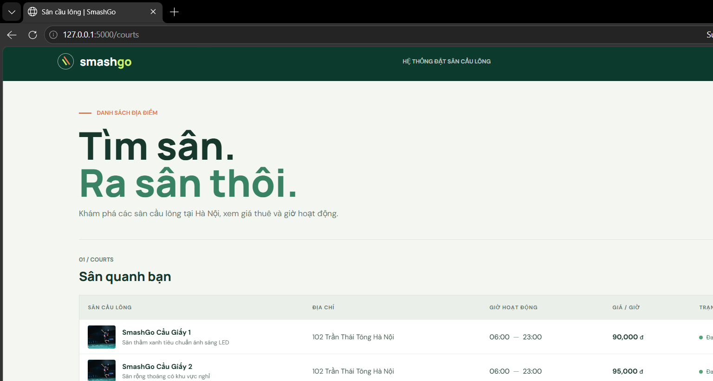

# Milestone 2 - Design Document

**Team:** Team 01 - SmashGo

**Topic:** D2 - Sports Platform

**Members:**

- Chử Vũ Thảo Hiền
- Phan Thị Anh Quỳnh
- Bùi Phương Thảo

**Product Owner:** @dqchien

**Scrum Master:** @Buithaoaineu (Sprint 2)

**Repository:** https://github.com/SE-FDA-NEU-AI66B/software-group1-topicd2.git

**Project board:** https://github.com/orgs/SE-FDA-NEU-AI66B/projects/24

**Setup guide:** N/A

**Submitted by:** Chử Vũ Thảo Hiền

---


---

## 1. Architecture

SmashGo is a badminton court booking platform with four user roles: **Guest** (browses courts), **User** (books and pays), **Manager** (court owner: adds, edits and deletes their own courts) and **Admin** (approves new courts, tracks commission). All four roles use the system through a web browser. The diagram below shows the container level (C4): what runs where, and what travels along every arrow.


### 1.1 Components

| Component              | Runs where                                             | Responsibility                                                                                                                                                                                                                                                   |
| ---------------------- | ------------------------------------------------------ | ---------------------------------------------------------------------------------------------------------------------------------------------------------------------------------------------------------------------------------------------------------------- |
| Browser                | User's phone or computer                               | Shows pages to Guest, User, Manager and Admin; sends forms, search filters and booking requests.                                                                                                                                                                 |
| SmashGo Web App        | Application server (`<framework>`)                     | Handles routes, login, role checks (Guest / User / Manager / Admin) and renders pages, including the in-app notifications shown to the user. Passes validated requests to the Booking Service.                                                                   |
| Booking Service        | Same server, separate module (`src/<booking_service>`) | Enforces the business rules: no double booking of one court in one time slot, new-court requests waiting for Admin approval, commission, court recommendation by filter, booking reminders (created as in-app notifications), and usage statistics by time slot. |
| Database               | Database file or server (`<database>`)                 | Stores users, courts, bookings, court requests, court reports and notifications. Its constraints back up the rules above.                                                                                                                                        |
| Bank / Payment gateway | External system                                        | Links the User's bank and confirms payment for a booking.                                                                                                                                                                                                        |

### 1.2 Connections

| From → To                                | What travels along it                                                                                                 |
| ---------------------------------------- | --------------------------------------------------------------------------------------------------------------------- |
| Browser → Web App                        | HTTP request (login form, search filters, booking form, court management form)                                        |
| Web App → Browser                        | Rendered pages (HTML), including in-app notifications                                                                 |
| Web App → Booking Service                | Function call (validated request together with the user's role)                                                       |
| Booking Service → Database               | SQL query (SELECT free time slots, INSERT booking, INSERT court request, UPDATE approval status, INSERT notification) |
| Booking Service → Bank / Payment gateway | HTTPS API call (payment request, bank link)                                                                           |
| Bank / Payment gateway → Booking Service | HTTPS callback (payment result)                                                                                       |

### 1.3 How the main flows move through the system

- **User books a court:** Browser sends the booking form (HTTP request) → Web App checks that the user is logged in → Booking Service checks the time slot is free and inserts the booking (SQL query; the database rejects a second booking of the same court and slot) → Booking Service asks the Bank for payment (HTTPS API call) → page confirms the booking.
- **Manager adds a new court:** Manager submits the court form → Booking Service stores it as a request with status "pending" (SQL query) → Admin sees the pending request on their page and approves or rejects it → only approved courts appear to Guests and Users.
- **Reminder:** the Booking Service checks for bookings starting in about 4 hours (SQL query) and saves a reminder notification for each User (SQL query). The next time the User's browser loads a page (HTTP request), the Web App reads the unread notifications and shows them in the page. Notifications are sent from inside the app; no external notification service is used.

---

## 2. Data model

### 2.1 ERD


### 2.2 Table descriptions

#### `Users`: Stores all user accounts and their roles in the SmashGo system.

| Column       | Type         | PK  | FK  | Constraint                                                 | Enforces (M1 rule)     |
| ------------ | ------------ | --- | --- | ---------------------------------------------------------- | ---------------------- |
| UserID       | INTEGER      | ✔   |     | `PRIMARY KEY`, `AUTO_INCREMENT`                            |                        |
| FullName     | VARCHAR(100) |     |     | `NOT NULL`                                                 |                        |
| Email        | VARCHAR(150) |     |     | `NOT NULL`, `UNIQUE`                                       |                        |
| PasswordHash | VARCHAR(255) |     |     | `NOT NULL`                                                 |                        |
| Phone        | VARCHAR(20)  |     |     |                                                            |                        |
| Role         | VARCHAR(20)  |     |     | `NOT NULL`, `CHECK (Role IN ('USER', 'MANAGER', 'ADMIN'))` | Access rules, BR6, BR7 |
| CreatedAt    | DATETIME     |     |     | `NOT NULL`, `DEFAULT CURRENT_TIMESTAMP`                    |                        |

`Role` determines whether an account acts as a User, Manager, or Admin. Self-registration creates only accounts with role `USER`; Manager and Admin accounts are provisioned separately. Access to protected functions is controlled according to the user's role. The table is named `Users` (not `User`) because `USER` is a reserved keyword in most SQL databases. Only a password hash is stored, never the plain password.

---

#### `Court`: Stores badminton court information, ownership, operating hours, availability status, and hourly price.

| Column       | Type          | PK  | FK             | Constraint                                                            | Enforces (M1 rule)        |
| ------------ | ------------- | --- | -------------- | --------------------------------------------------------------------- | ------------------------- |
| CourtID      | INTEGER       | ✔   |                | `PRIMARY KEY`, `AUTO_INCREMENT`                                       |                           |
| ManagerID    | INTEGER       |     | `Users.UserID` | `NOT NULL`                                                            | Manager ownership rule    |
| CourtName    | VARCHAR(100)  |     |                | `NOT NULL`                                                            | US-10                     |
| Location     | VARCHAR(255)  |     |                | `NOT NULL`                                                            | US-02, US-10              |
| Description  | TEXT          |     |                |                                                                       | US-02                     |
| PricePerHour | DECIMAL(10,2) |     |                | `NOT NULL`, `CHECK (PricePerHour >= 0)`                               | US-02, US-10              |
| OpenTime     | TIME          |     |                | `NOT NULL`                                                            | US-03                     |
| CloseTime    | TIME          |     |                | `NOT NULL`, `CHECK (CloseTime > OpenTime)`                            | US-03                     |
| Status       | VARCHAR(20)   |     |                | `NOT NULL`, `CHECK (Status IN ('ACTIVE', 'DISABLED', 'MAINTENANCE'))` | US-01, Court disable rule |
| CreatedAt    | DATETIME      |     |                | `NOT NULL`, `DEFAULT CURRENT_TIMESTAMP`                               |                           |

`ManagerID` identifies the Manager who owns the court. A Manager can only view and edit their own courts, and can only add a new court by submitting a `Court_Request` that an Admin approves. Admin can manage courts across all Managers. A court with upcoming bookings cannot be disabled. `OpenTime` and `CloseTime` define the hours in which time slots can be offered to Users. Only courts with status `ACTIVE` appear in search results and can be booked.

---

#### `Court_Image`: Stores the photos of a court shown on the court detail page.

| Column    | Type         | PK  | FK              | Constraint                              | Enforces (M1 rule) |
| --------- | ------------ | --- | --------------- | --------------------------------------- | ------------------ |
| ImageID   | INTEGER      | ✔   |                 | `PRIMARY KEY`, `AUTO_INCREMENT`         |                    |
| CourtID   | INTEGER      |     | `Court.CourtID` | `NOT NULL`, `ON DELETE CASCADE`         | US-02              |
| Url       | VARCHAR(500) |     |                 | `NOT NULL`                              | US-02              |
| SortOrder | INTEGER      |     |                 | `NOT NULL`, `DEFAULT 0`                 | US-02              |
| CreatedAt | DATETIME     |     |                 | `NOT NULL`, `DEFAULT CURRENT_TIMESTAMP` |                    |

A court can have many photos. `SortOrder` decides the display order; the photo with the lowest value is shown first.

---

#### `Court_Block`: Stores time ranges in which a court cannot be booked (maintenance, events).

| Column    | Type         | PK  | FK              | Constraint                                | Enforces (M1 rule)     |
| --------- | ------------ | --- | --------------- | ----------------------------------------- | ---------------------- |
| BlockID   | INTEGER      | ✔   |                 | `PRIMARY KEY`, `AUTO_INCREMENT`           |                        |
| CourtID   | INTEGER      |     | `Court.CourtID` | `NOT NULL`, `ON DELETE CASCADE`           | US-03                  |
| BlockDate | DATE         |     |                 | `NOT NULL`                                | US-03                  |
| StartTime | TIME         |     |                 | `NOT NULL`                                | US-03                  |
| EndTime   | TIME         |     |                 | `NOT NULL`, `CHECK (EndTime > StartTime)` | US-03                  |
| Reason    | VARCHAR(255) |     |                 |                                           |                        |
| CreatedBy | INTEGER      |     | `Users.UserID`  | `NOT NULL`                                | Manager ownership rule |
| CreatedAt | DATETIME     |     |                 | `NOT NULL`, `DEFAULT CURRENT_TIMESTAMP`   |                        |

Time slots that fall inside a block are shown as unavailable when Users view the court schedule. `CreatedBy` must be the court's Manager or an Admin.

---

#### `Booking`: Records a user's reservation for a specific court, date, and time interval.

| Column                | Type          | PK  | FK              | Constraint                                                                                                  | Enforces (M1 rule) |
| --------------------- | ------------- | --- | --------------- | ----------------------------------------------------------------------------------------------------------- | ------------------ |
| BookingID             | INTEGER       | ✔   |                 | `PRIMARY KEY`, `AUTO_INCREMENT`                                                                             |                    |
| UserID                | INTEGER       |     | `Users.UserID`  | `NOT NULL`                                                                                                  | BR6, US-08         |
| CourtID               | INTEGER       |     | `Court.CourtID` | `NOT NULL`                                                                                                  | BR1, BR2           |
| BookingDate           | DATE          |     |                 | `NOT NULL`                                                                                                  | BR1, BR2, BR3      |
| StartTime             | TIME          |     |                 | `NOT NULL`                                                                                                  | BR1, BR2, BR3, BR5 |
| EndTime               | TIME          |     |                 | `NOT NULL`, `CHECK (EndTime > StartTime)`                                                                   | BR1, BR2           |
| TotalAmount           | DECIMAL(10,2) |     |                 | `NOT NULL`, `CHECK (TotalAmount >= 0)`                                                                      |                    |
| DepositAmount         | DECIMAL(10,2) |     |                 | `NOT NULL`, `CHECK (DepositAmount >= 0)`                                                                    | BR4                |
| Status                | VARCHAR(20)   |     |                 | `NOT NULL`, `CHECK (Status IN ('PENDING', 'CONFIRMED', 'CHECKED_IN', 'COMPLETED', 'CANCELLED', 'EXPIRED'))` | BR1, BR3, BR4, BR6 |
| HoldExpiresAt         | DATETIME      |     |                 |                                                                                                             | BR3                |
| ReminderOffsetMinutes | INTEGER       |     |                 | `NOT NULL`, `DEFAULT 240`, `CHECK (ReminderOffsetMinutes > 0)`                                              | BR5, US-07         |
| CancelledAt           | DATETIME      |     |                 |                                                                                                             | BR4, US-06         |
| CancelledBy           | INTEGER       |     | `Users.UserID`  |                                                                                                             | US-06              |
| CancelReason          | VARCHAR(255)  |     |                 |                                                                                                             | US-06              |
| CreatedAt             | DATETIME      |     |                 | `NOT NULL`, `DEFAULT CURRENT_TIMESTAMP`                                                                     | BR3                |

`Booking` is the central entity connecting a User and a Court. `TotalAmount` is a snapshot of the price at booking time, so later changes to `Court.PricePerHour` do not affect existing bookings. `HoldExpiresAt` records the 10-minute payment-hold deadline; a `PENDING` booking whose deadline has passed is automatically changed to `EXPIRED` and its slot is released. `CancelledAt` is compared with the start time to decide the refund level in BR4 (more than 4 hours before: full refund; within 4 hours: 50% of the deposit is forfeited). `CancelledBy` is the User who owns the booking or the Manager of the court. `ReminderOffsetMinutes` defaults to 240 minutes (4 hours before start) and is used to compute `Notification.ScheduledAt`.

BR1 and BR2 are interval-based business rules and cannot be enforced by a simple `UNIQUE` constraint. A booking in status `PENDING`, `CONFIRMED` or `CHECKED_IN` occupies its time slot, so the overlap check must include `PENDING` bookings that are still being held; `CANCELLED` and `EXPIRED` bookings release the slot. On PostgreSQL this is enforced in the database with an exclusion constraint on `(CourtID, time range of BookingDate + StartTime/EndTime)` filtered by those three statuses. On databases without exclusion constraints, the service performs the check inside a transaction with a row lock (`SELECT ... FOR UPDATE`) or a trigger. The minimum one-hour and contiguous-slot requirements (BR2) and the limit of 2 active bookings per user (BR6) are validated in the Booking Service.

---

#### `Payment`: Records the payment transaction for a booking using a verified bank account.

| Column          | Type          | PK  | FK                          | Constraint                                                                                         | Enforces (M1 rule) |
| --------------- | ------------- | --- | --------------------------- | -------------------------------------------------------------------------------------------------- | ------------------ |
| PaymentID       | INTEGER       | ✔   |                             | `PRIMARY KEY`, `AUTO_INCREMENT`                                                                    |                    |
| BookingID       | INTEGER       |     | `Booking.BookingID`         | `NOT NULL`, `UNIQUE`                                                                               | BR3, BR4           |
| BankAccountID   | INTEGER       |     | `BankAccount.BankAccountID` | `NOT NULL`                                                                                         | BR7                |
| Amount          | DECIMAL(10,2) |     |                             | `NOT NULL`, `CHECK (Amount >= 0)`                                                                  |                    |
| PaymentMethod   | VARCHAR(30)   |     |                             | `NOT NULL`                                                                                         | BR7                |
| TransactionCode | VARCHAR(100)  |     |                             | `UNIQUE`                                                                                           |                    |
| Status          | VARCHAR(20)   |     |                             | `NOT NULL`, `CHECK (Status IN ('PENDING', 'SUCCESS', 'FAILED', 'REFUNDED', 'PARTIALLY_REFUNDED'))` | BR3, BR4, BR7      |
| RefundAmount    | DECIMAL(10,2) |     |                             | `CHECK (RefundAmount >= 0)`                                                                        | BR4                |
| PaidAt          | DATETIME      |     |                             |                                                                                                    | BR3                |
| RefundedAt      | DATETIME      |     |                             |                                                                                                    | BR4                |

Each booking can have at most one payment record in the current model. `Amount` is the amount actually paid for the booking (the deposit in the current model). Payment is allowed only after the user has successfully linked and verified a bank account.

`RefundAmount` and `RefundedAt` support the cancellation/refund policy in BR4: status `REFUNDED` means a full refund, and `PARTIALLY_REFUNDED` means the 50% forfeit case.

---

#### `BankAccount`: Stores bank accounts linked to user accounts for payment.

| Column            | Type         | PK  | FK             | Constraint                              | Enforces (M1 rule) |
| ----------------- | ------------ | --- | -------------- | --------------------------------------- | ------------------ |
| BankAccountID     | INTEGER      | ✔   |                | `PRIMARY KEY`, `AUTO_INCREMENT`         |                    |
| UserID            | INTEGER      |     | `Users.UserID` | `NOT NULL`                              | BR7                |
| BankName          | VARCHAR(100) |     |                | `NOT NULL`                              | BR7                |
| AccountNumber     | VARCHAR(50)  |     |                | `NOT NULL`                              | BR7                |
| AccountHolderName | VARCHAR(150) |     |                | `NOT NULL`                              | BR7                |
| IsVerified        | BOOLEAN      |     |                | `NOT NULL`, `DEFAULT FALSE`             | BR7                |
| VerifiedAt        | DATETIME     |     |                |                                         | BR7                |
| CreatedAt         | DATETIME     |     |                | `NOT NULL`, `DEFAULT CURRENT_TIMESTAMP` |                    |

Table-level constraint: `UNIQUE (UserID, BankName, AccountNumber)` prevents the same account from being linked twice by one user.

A User can link one or more bank accounts. A bank account must be verified before it can be used for payment. `AccountNumber` is sensitive data and should be encrypted, or only its last 4 digits stored.

---

#### `BankAccountVerification`: Stores OTP verification attempts for linked bank accounts.

| Column         | Type         | PK  | FK                          | Constraint                                                                   | Enforces (M1 rule) |
| -------------- | ------------ | --- | --------------------------- | ---------------------------------------------------------------------------- | ------------------ |
| VerificationID | INTEGER      | ✔   |                             | `PRIMARY KEY`, `AUTO_INCREMENT`                                              |                    |
| BankAccountID  | INTEGER      |     | `BankAccount.BankAccountID` | `NOT NULL`                                                                   | BR7                |
| OTPHash        | VARCHAR(255) |     |                             | `NOT NULL`                                                                   | BR7                |
| ExpiresAt      | DATETIME     |     |                             | `NOT NULL`                                                                   | BR7                |
| AttemptCount   | INTEGER      |     |                             | `NOT NULL`, `DEFAULT 0`, `CHECK (AttemptCount >= 0)`                         | BR7                |
| VerifiedAt     | DATETIME     |     |                             |                                                                              | BR7                |
| Status         | VARCHAR(20)  |     |                             | `NOT NULL`, `CHECK (Status IN ('PENDING', 'VERIFIED', 'FAILED', 'EXPIRED'))` | BR7                |
| CreatedAt      | DATETIME     |     |                             | `NOT NULL`, `DEFAULT CURRENT_TIMESTAMP`                                      | BR7                |

This table records the OTP verification process. `AttemptCount` counts wrong OTP entries; when it reaches the allowed limit the verification is set to `FAILED`. Payment must not proceed unless the corresponding bank account has a successful verification.

---

#### `Notification`: Stores notifications and scheduled booking reminders sent to users.

| Column         | Type         | PK  | FK                  | Constraint                                                                                                                                                            | Enforces (M1 rule) |
| -------------- | ------------ | --- | ------------------- | --------------------------------------------------------------------------------------------------------------------------------------------------------------------- | ------------------ |
| NotificationID | INTEGER      | ✔   |                     | `PRIMARY KEY`, `AUTO_INCREMENT`                                                                                                                                       |                    |
| UserID         | INTEGER      |     | `Users.UserID`      | `NOT NULL`                                                                                                                                                            | BR5                |
| BookingID      | INTEGER      |     | `Booking.BookingID` |                                                                                                                                                                       | BR5                |
| Title          | VARCHAR(150) |     |                     | `NOT NULL`                                                                                                                                                            |                    |
| Message        | TEXT         |     |                     | `NOT NULL`                                                                                                                                                            |                    |
| Type           | VARCHAR(30)  |     |                     | `NOT NULL`, e.g. `BOOKING_REMINDER`, `BOOKING_CONFIRMATION`, `CANCELLATION`, `PAYMENT`, `REFUND`, `COURT_REQUEST_RESULT`, `NEW_COURT_REPORT`, `COURT_REPORT_RESPONSE` | BR5                |
| IsRead         | BOOLEAN      |     |                     | `NOT NULL`, `DEFAULT FALSE`                                                                                                                                           |                    |
| ScheduledAt    | DATETIME     |     |                     |                                                                                                                                                                       | BR5                |
| SentAt         | DATETIME     |     |                     |                                                                                                                                                                       | BR5                |
| CreatedAt      | DATETIME     |     |                     | `NOT NULL`, `DEFAULT CURRENT_TIMESTAMP`                                                                                                                               |                    |

For a booking reminder, `ScheduledAt` is set to `ReminderOffsetMinutes` (default 4 hours) before the booking's start time. Cancelled bookings must not trigger their scheduled reminder. `BookingID` is empty for notifications that do not belong to a booking, such as the result of a court request or a court report: a Manager is notified when a User reports one of their courts (`NEW_COURT_REPORT`), and the reporting User is notified when the Manager responds (`COURT_REPORT_RESPONSE`).

---

#### `CheckIn`: Records the check-in of a User for a confirmed booking.

| Column      | Type        | PK  | FK                  | Constraint                                     | Enforces (M1 rule) |
| ----------- | ----------- | --- | ------------------- | ---------------------------------------------- | ------------------ |
| CheckInID   | INTEGER     | ✔   |                     | `PRIMARY KEY`, `AUTO_INCREMENT`                |                    |
| BookingID   | INTEGER     |     | `Booking.BookingID` | `NOT NULL`, `UNIQUE`                           | US-09              |
| CheckedInAt | DATETIME    |     |                     | `NOT NULL`                                     | US-09              |
| Status      | VARCHAR(20) |     |                     | `NOT NULL`, `CHECK (Status IN ('CHECKED_IN'))` | US-09              |
| CreatedAt   | DATETIME    |     |                     | `NOT NULL`, `DEFAULT CURRENT_TIMESTAMP`        | US-09              |

A check-in is accepted only when the User has a valid `CONFIRMED` booking for the selected court and time. When accepted, a `CheckIn` row is created and `Booking.Status` is changed to `CHECKED_IN` in the same transaction. An invalid check-in attempt is rejected by the service and does not create any `CheckIn` record. The User and the Court of a check-in are not stored again; they are read through `BookingID`, which avoids inconsistent data.

---

#### `Court_Report`: Records reports submitted by users about badminton courts and their handling by the court's Manager.

| Column          | Type         | PK  | FK              | Constraint                                                                      | Enforces (M1 rule)     |
| --------------- | ------------ | --- | --------------- | ------------------------------------------------------------------------------- | ---------------------- |
| ReportID        | INTEGER      | ✔   |                 | `PRIMARY KEY`, `AUTO_INCREMENT`                                                 |                        |
| UserID          | INTEGER      |     | `Users.UserID`  | `NOT NULL`                                                                      |                        |
| CourtID         | INTEGER      |     | `Court.CourtID` | `NOT NULL`                                                                      |                        |
| Reason          | VARCHAR(150) |     |                 | `NOT NULL`                                                                      |                        |
| Description     | TEXT         |     |                 |                                                                                 |                        |
| Status          | VARCHAR(20)  |     |                 | `NOT NULL`, `CHECK (Status IN ('OPEN', 'IN_PROGRESS', 'RESOLVED', 'REJECTED'))` |                        |
| ManagerResponse | TEXT         |     |                 |                                                                                 |                        |
| HandledBy       | INTEGER      |     | `Users.UserID`  |                                                                                 | Manager ownership rule |
| HandledAt       | DATETIME     |     |                 |                                                                                 |                        |
| CreatedAt       | DATETIME     |     |                 | `NOT NULL`, `DEFAULT CURRENT_TIMESTAMP`                                         |                        |

A User can submit reports about a specific Court. The report is sent to the Manager who owns the court (`Court.ManagerID`), and that Manager handles it: they move the status from `OPEN` to `IN_PROGRESS`, then to `RESOLVED` or `REJECTED`, and write their answer in `ManagerResponse`. `HandledBy` must be the same user as `Court.ManagerID` of the reported court; the Booking Service checks this because it cannot be expressed as a simple column constraint. Court reports are an extension beyond the M1 requirements.

---

#### `Court_Request`: Stores court requests (create, update, disable) submitted by Managers and reviewed by Admins.

| Column       | Type          | PK  | FK              | Constraint                                                           | Enforces (M1 rule)     |
| ------------ | ------------- | --- | --------------- | -------------------------------------------------------------------- | ---------------------- |
| RequestID    | INTEGER       | ✔   |                 | `PRIMARY KEY`, `AUTO_INCREMENT`                                      |                        |
| ManagerID    | INTEGER       |     | `Users.UserID`  | `NOT NULL`                                                           | Manager ownership rule |
| RequestType  | VARCHAR(20)   |     |                 | `NOT NULL`, `CHECK (RequestType IN ('CREATE', 'UPDATE', 'DISABLE'))` | Admin review rule      |
| CourtID      | INTEGER       |     | `Court.CourtID` |                                                                      | Manager ownership rule |
| CourtName    | VARCHAR(100)  |     |                 |                                                                      |                        |
| Location     | VARCHAR(255)  |     |                 |                                                                      |                        |
| Description  | TEXT          |     |                 |                                                                      |                        |
| PricePerHour | DECIMAL(10,2) |     |                 | `CHECK (PricePerHour >= 0)`                                          |                        |
| OpenTime     | TIME          |     |                 |                                                                      |                        |
| CloseTime    | TIME          |     |                 | `CHECK (CloseTime > OpenTime)`                                       |                        |
| Reason       | TEXT          |     |                 |                                                                      |                        |
| Status       | VARCHAR(20)   |     |                 | `NOT NULL`, `CHECK (Status IN ('PENDING', 'APPROVED', 'REJECTED'))`  | Admin review rule      |
| RejectReason | TEXT          |     |                 |                                                                      | Admin review rule      |
| ReviewedBy   | INTEGER       |     | `Users.UserID`  |                                                                      | Admin review rule      |
| CreatedAt    | DATETIME      |     |                 | `NOT NULL`, `DEFAULT CURRENT_TIMESTAMP`                              |                        |
| ReviewedAt   | DATETIME      |     |                 |                                                                      |                        |

`ManagerID` identifies the Manager who submits the request. `ReviewedBy` identifies the Admin who reviews it. The referenced `Users` row for `ManagerID` must have role `MANAGER`, while the one for `ReviewedBy` must have role `ADMIN`.

`RequestType` tells what the Manager asks for. For `CREATE`, `CourtID` is empty and `CourtName`, `Location`, `PricePerHour`, `OpenTime` and `CloseTime` are required; when an Admin approves, a new `Court` row is created with this Manager as owner and the images of the request are copied to `Court_Image`. For `UPDATE` and `DISABLE`, `CourtID` is required and must be a court owned by the same Manager; `UPDATE` carries the new values, and `DISABLE` is refused while the court has upcoming bookings. These per-type rules are validated in the Booking Service. When a request is rejected, the Admin explains why in `RejectReason`, and the Manager is notified through a `COURT_REQUEST_RESULT` notification.

---

#### `Court_Request_Image`: Stores the photos attached to a court request.

| Column    | Type         | PK  | FK                        | Constraint                      | Enforces (M1 rule) |
| --------- | ------------ | --- | ------------------------- | ------------------------------- | ------------------ |
| ImageID   | INTEGER      | ✔   |                           | `PRIMARY KEY`, `AUTO_INCREMENT` |                    |
| RequestID | INTEGER      |     | `Court_Request.RequestID` | `NOT NULL`, `ON DELETE CASCADE` | US-02              |
| Url       | VARCHAR(500) |     |                           | `NOT NULL`                      | US-02              |
| SortOrder | INTEGER      |     |                           | `NOT NULL`, `DEFAULT 0`         | US-02              |

The Admin reviews these photos together with the request. They are kept as part of the request history and are copied to `Court_Image` when a `CREATE` request is approved.

---

## 3. API design

| Method | Path         | Input          | Success        | Error codes                 |
| ------ | ------------ | -------------- | -------------- | --------------------------- |
| GET    | `/api/<...>` | <query params> | 200 · <output> | 400 <reason>                |
| POST   | `/api/<...>` | <body fields>  | 201 · <output> | 401 <reason> · 409 <reason> |

**Coverage of P0 stories:**

| P0 story | Endpoint(s)   |
| -------- | ------------- |
| US<xx>   | <method path> |

---

## 4. Walking skeleton

- **Route:** `GET /courts` (`app.py`), rendered from a SQL query against SQLite.
- **Table read:** `Court` and its first `Court_Image` (lowest `SortOrder`); 12 active courts are seeded from `data/courts.csv` by `python init_db.py`.
- **Schema:** `schema.sql` creates all 13 tables in the ERD. Only `Users`, `Court`, and `Court_Image` receive seed data for this walking skeleton.
- **Configuration:** `.env.example` documents host, port, database path, and debug mode; `.env` and the SQLite database are ignored by Git.
- **Full installation steps:** see [docs/SETUP.md](SETUP.md).

**Screenshot of the running page:**



**Query behind the page:**

```sql
SELECT Court.CourtID, Court.CourtName, Court.Location,
       Court.Description, Court.PricePerHour, Court.OpenTime,
       Court.CloseTime,
       (SELECT Court_Image.Url
	FROM Court_Image
	WHERE Court_Image.CourtID = Court.CourtID
	ORDER BY Court_Image.SortOrder, Court_Image.ImageID
	LIMIT 1) AS ImageUrl
FROM Court
WHERE Court.Status = 'ACTIVE'
ORDER BY Court.CourtID;
```

---

## 5. Design decisions

### Decision 1: <title>

- **Options considered:** <option A> · <option B> · <option C>
- **Chosen:** <option>
- **Why:** <reason tied to the project's constraints>
- **What would change our mind:** <a concrete, testable condition>

### Decision 2: <title>

- **Options considered:** <option A> · <option B>
- **Chosen:** <option>
- **Why:** <reason>
- **What would change our mind:** <condition>

---

## 6. What changed since M1

### Change 1: <short title>

- **What changed:** <requirement / user story / rule that was modified>
- **Why:** <feedback source and reasoning>
- **Related issue:** #<n>

### Change 2: <short title>

- **What changed:** <...>
- **Why:** <...>
- **Related issue:** #<n>
